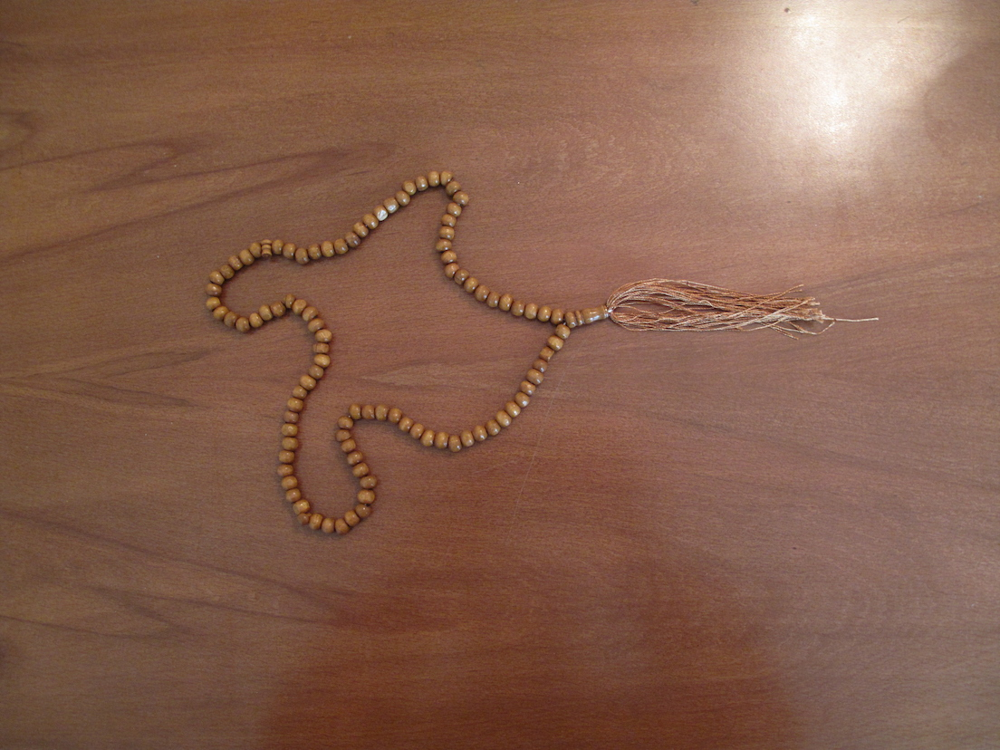
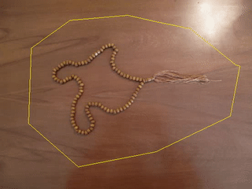

## Dependencies

- Opencv `cv2`
- Matplotlib `matplotlib`
- Numpy `numpy`
- SciPy `scipy`
## Project Definition

todo

## Results

| Input | Output |
| ------ | ------ |
|  |  |

## References Papers

The papers used in this project are in `paper_recources/` directory.

### Image Processing Course Project
